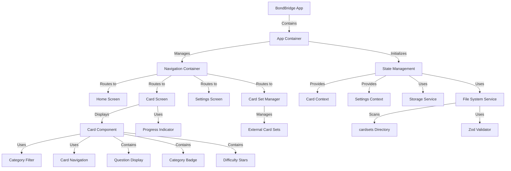
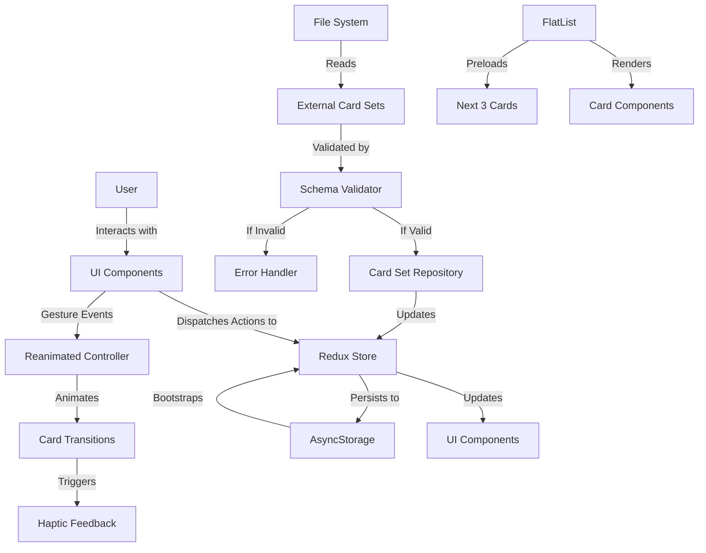
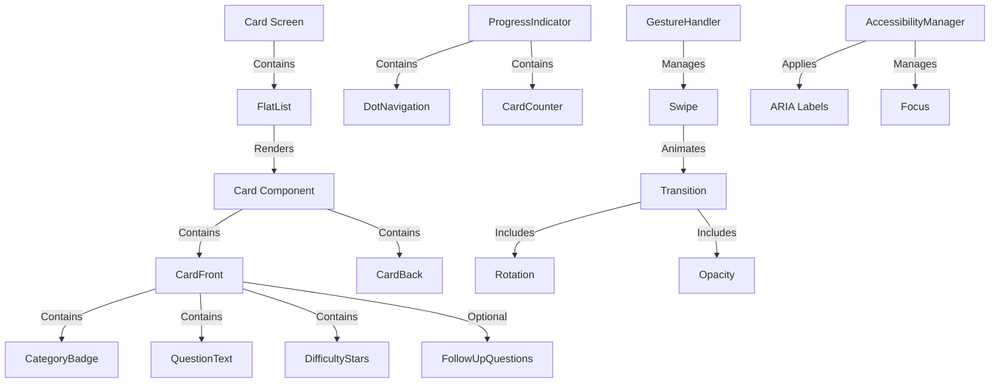

# Architecture for BondBridge

Status: Approved

## Related Documents

This Architecture Document references information from the following documents:

- [Project Overview](/memory-bank/README.md)
- [System Patterns](/memory-bank/systemPatterns.md)
- [Product Context](/memory-bank/productContext.md)
- [Active Context](/memory-bank/activeContext.md)
- [Implementation Plan](/memory-bank/implementationPlan.md)
- [PRD](prd.md)

## Technical Summary

BondBridge is a React Native mobile application designed to help couples deepen their relationships through conversation cards. The architecture follows a feature-based approach with clear separation of concerns, as outlined in [System Patterns](/memory-bank/systemPatterns.md), emphasizing offline-first functionality and extensibility through external card sets. All data is stored locally using AsyncStorage, with no backend requirements for the MVP. The application will support automatic detection and integration of user-provided card sets stored in a designated directory, validated through Zod schema validation, following the requirements specified in [Product Context](/memory-bank/productContext.md).

## Technology Table

| Technology              | Description                               | Purpose                                       |
| ----------------------- | ----------------------------------------- | --------------------------------------------- |
| React Native            | Cross-platform mobile framework           | Core application development                  |
| Expo                    | Development platform for React Native     | Simplified development and deployment         |
| TypeScript              | Typed superset of JavaScript              | Type safety and improved developer experience |
| React Navigation        | Navigation library for React Native apps  | Screen navigation and routing                 |
| React Native Elements   | UI component library                      | Consistent UI components                      |
| NativeWind              | Tailwind CSS for React Native             | Streamlined styling                           |
| React Native Reanimated | Library for fluid animations              | Card swiping and transitions                  |
| AsyncStorage            | Local data persistence solution           | Offline data storage                          |
| react-native-fs         | File system access for external card sets | Accessing card set files                      |
| Zod                     | TypeScript-first schema validation        | Validating external card sets                 |
| Redux Toolkit           | State management library                  | Centralized application state                 |
| Flipper                 | Mobile app debugger                       | Performance monitoring and debugging          |

## Architectural Diagrams

### Application Architecture



### Data Flow Architecture



### Component Architecture



## Optimized Implementation Details

### Component Design for UX/UI

The application's component design is optimized to deliver the specified UX/UI requirements while maintaining performance:

#### Card Component Architecture

```typescript
// High-level component structure
const Card = React.memo(({ card, isActive }) => {
  // Memoized to prevent unnecessary re-renders
  return (
    <Animated.View style={[styles.card, animatedStyle]}>
      <CategoryBadge category={card.category} />
      <QuestionText text={card.question} />
      {card.followUpQuestions && (
        <FollowUpQuestions questions={card.followUpQuestions} />
      )}
      <DifficultyIndicator level={card.difficulty} />
    </Animated.View>
  );
});
```

The Card component uses sub-components for:

- **CategoryBadge**: Displays category name with appropriate accent color
- **QuestionText**: Renders the main question with proper typography
- **FollowUpQuestions**: Shows optional follow-up questions with proper indentation
- **DifficultyIndicator**: Displays 1-5 stars based on difficulty level

Each sub-component is styled according to the PRD specifications, with proper font sizes, colors, and layout parameters.

#### Progress Indicator Implementation

```typescript
const ProgressIndicator = ({ currentIndex, totalCards }) => {
  return (
    <View style={styles.progressContainer}>
      <DotNavigation
        currentIndex={currentIndex}
        totalDots={totalCards}
        dotSize={8}
        dotSpacing={4}
        activeDotColor="#4A90E2"
        inactiveDotColor="#E0E0E0"
      />
      <CardCounter current={currentIndex + 1} total={totalCards} />
    </View>
  );
};
```

The ProgressIndicator updates in real-time through Redux state changes, providing visual feedback on card navigation.

### Efficient Data Management

#### FlatList Optimization

```typescript
const CardList = ({ cards, currentIndex, onCardChange }) => {
  const viewabilityConfig = {
    itemVisiblePercentThreshold: 50,
    waitForInteraction: true,
  };

  const onViewableItemsChanged = useCallback(
    ({ viewableItems }) => {
      if (viewableItems.length > 0) {
        onCardChange(viewableItems[0].index);
      }
    },
    [onCardChange]
  );

  return (
    <FlatList
      data={cards}
      renderItem={({ item, index }) => (
        <Card card={item} isActive={index === currentIndex} />
      )}
      horizontal
      pagingEnabled
      showsHorizontalScrollIndicator={false}
      initialNumToRender={1}
      maxToRenderPerBatch={3}
      windowSize={5} // Keeps 5 items in memory
      viewabilityConfig={viewabilityConfig}
      onViewableItemsChanged={onViewableItemsChanged}
      keyExtractor={(item) => item.id}
    />
  );
};
```

Key optimizations include:

- **Memoization**: Using `React.memo` to prevent unnecessary re-renders
- **Preloading**: Configuring FlatList to preload the next 3 cards
- **Efficient Rendering**: Using appropriate FlatList parameters to optimize rendering
- **Batched Updates**: Leveraging React's batched updates for state changes

### Animation and Interaction

#### Swipe Gesture Implementation with Reanimated

```typescript
const CardSwipe = ({ onSwipeLeft, onSwipeRight }) => {
  const translateX = useSharedValue(0);
  const rotation = useSharedValue(0);
  const opacity = useSharedValue(1);

  const panGesture = useAnimatedGestureHandler({
    onStart: (_, ctx) => {
      ctx.startX = translateX.value;
    },
    onActive: (event, ctx) => {
      translateX.value = ctx.startX + event.translationX;
      // Calculate rotation (max 5 degrees)
      rotation.value = (translateX.value / 100) * 5;
      // Slight opacity change during swipe
      opacity.value = withTiming(0.9, { duration: 100 });
    },
    onEnd: (event) => {
      const threshold = 100;

      if (event.translationX > threshold) {
        // Swipe right - previous card
        translateX.value = withTiming(500, { duration: 300 });
        rotation.value = withTiming(5, { duration: 300 });
        opacity.value = withTiming(0, { duration: 300 });
        runOnJS(onSwipeRight)();
        ReactNativeHapticFeedback.trigger("impactLight");
      } else if (event.translationX < -threshold) {
        // Swipe left - next card
        translateX.value = withTiming(-500, { duration: 300 });
        rotation.value = withTiming(-5, { duration: 300 });
        opacity.value = withTiming(0, { duration: 300 });
        runOnJS(onSwipeLeft)();
        ReactNativeHapticFeedback.trigger("impactLight");
      } else {
        // Return to center if threshold not reached
        translateX.value = withTiming(0, { duration: 300 });
        rotation.value = withTiming(0, { duration: 300 });
        opacity.value = withTiming(1, { duration: 300 });
      }
    },
  });

  const animatedStyle = useAnimatedStyle(() => {
    return {
      transform: [
        { translateX: translateX.value },
        { rotateZ: `${rotation.value}deg` },
      ],
      opacity: opacity.value,
    };
  });

  return (
    <PanGestureHandler onGestureEvent={panGesture}>
      <Animated.View style={animatedStyle}>{children}</Animated.View>
    </PanGestureHandler>
  );
};
```

This implementation follows the PRD specifications for:

- **Animation Duration**: 300ms as specified
- **Rotation**: Maximum 5° rotation during swipe
- **Opacity Changes**: Subtle opacity transitions for feedback
- **Haptic Feedback**: Provides tactile response on successful swipe

### File Handling for Card Sets

#### CardSetLoader Service

```typescript
class CardSetLoader {
  constructor(private validator: ZodValidator) {}

  async scanDirectory(): Promise<ExternalCardSet[]> {
    try {
      const cardSetPath = `${RNFS.DocumentDirectoryPath}/cardsets`;

      // Create directory if it doesn't exist
      const exists = await RNFS.exists(cardSetPath);
      if (!exists) {
        await RNFS.mkdir(cardSetPath);
        return [];
      }

      // Read directory contents
      const files = await RNFS.readDir(cardSetPath);
      const jsonFiles = files.filter((file) => file.name.endsWith(".json"));

      // Process each JSON file
      const cardSets = await Promise.all(
        jsonFiles.map(async (file) => {
          try {
            const content = await RNFS.readFile(file.path, "utf8");
            const parsedContent = JSON.parse(content);

            // Validate with Zod
            const validationResult =
              this.validator.validateCardSet(parsedContent);

            if (validationResult.success) {
              return validationResult.data;
            } else {
              console.error(
                `Invalid card set: ${file.name}`,
                validationResult.error
              );
              return null;
            }
          } catch (error) {
            console.error(`Error processing file: ${file.name}`, error);
            return null;
          }
        })
      );

      // Filter out failed validations
      return cardSets.filter(Boolean) as ExternalCardSet[];
    } catch (error) {
      console.error("Error scanning card sets directory", error);
      return [];
    }
  }

  async handleIncomingFile(uri: string): Promise<ExternalCardSet | null> {
    try {
      // Copy file to app's card sets directory
      const fileName = uri.split("/").pop() || `cardset-${Date.now()}.json`;
      const destination = `${RNFS.DocumentDirectoryPath}/cardsets/${fileName}`;

      await RNFS.copyFile(uri, destination);

      // Read and validate the copied file
      const content = await RNFS.readFile(destination, "utf8");
      const parsedContent = JSON.parse(content);

      const validationResult = this.validator.validateCardSet(parsedContent);

      if (validationResult.success) {
        return validationResult.data;
      } else {
        // Clean up invalid file
        await RNFS.unlink(destination);
        return null;
      }
    } catch (error) {
      console.error("Error handling incoming file", error);
      return null;
    }
  }
}
```

This service:

- **Scans Directory**: Automatically scans for JSON files in the cardsets directory
- **Validates Content**: Uses Zod to validate card set structure
- **Handles Errors**: Gracefully handles malformed JSON or validation errors
- **Processes Incoming Files**: Handles files opened with the app via file associations

### Accessibility Integration

#### AccessibilityManager Component

```typescript
const AccessibilityManager = ({ children }) => {
  useEffect(() => {
    // Set up screen reader announcements for navigation events
    const unsubscribe = navigation.addListener("state", (state) => {
      const currentRoute = state.data.state.routes[state.data.state.index];
      announceForAccessibility(`Navigated to ${currentRoute.name}`);
    });

    return unsubscribe;
  }, [navigation]);

  return <>{children}</>;
};

// Example of accessible Card component
const AccessibleCard = ({ card }) => {
  return (
    <View
      accessible={true}
      accessibilityLabel={`Question: ${card.question}. Category: ${card.category}. Difficulty level: ${card.difficulty} out of 5.`}
      accessibilityHint="Swipe left for next card, right for previous card"
      accessibilityRole="button"
    >
      {/* Card content */}
    </View>
  );
};
```

Key accessibility features:

- **ARIA Labels**: Descriptive labels for screen readers
- **Focus Management**: Proper focus handling for navigation
- **Custom Announcements**: Screen reader announcements for important events
- **Touch Target Sizes**: All interactive elements meet the 44x44 point minimum size

### Performance Monitoring

#### Performance Optimization Strategy

```typescript
// Performance monitor setup
const setupPerformanceMonitoring = () => {
  if (__DEV__) {
    const { connectToDevTools } = require("react-devtools-core");
    connectToDevTools({
      host: "localhost",
      port: 8097,
    });

    // Flipper setup for performance monitoring
    const flipperPerformancePlugin = require("react-native-performance-flipper-reporter");
    flipperPerformancePlugin.setupDefaultFlipperReporter();

    // Track render times for key components
    flipperPerformancePlugin.trackRenderTime("CardComponent");
    flipperPerformancePlugin.trackRenderTime("CardList");
  }
};
```

The application implements:

- **Performance Monitoring**: Integration with Flipper for identifying bottlenecks
- **Component Profiling**: Tracking render times for key components
- **Memory Usage Tracking**: Monitoring memory consumption for large card sets
- **Error Boundaries**: Preventing crashes from component failures

## Comparative Analysis with Industry Standards

The architecture draws inspiration from successful relationship apps while maintaining BondBridge's unique focus:

### Inspiration from Leading Apps

| App       | Feature                  | BondBridge Implementation                                  |
| --------- | ------------------------ | ---------------------------------------------------------- |
| Paired    | Daily question prompts   | Card rotation with visual feedback on completion           |
| Between   | Private, intimate design | Warm color palette and comfortable typography              |
| Gottman   | Research-based questions | Categorized conversation cards with difficulty progression |
| Reflectly | Card-based UI            | Optimized card rendering with smooth transitions           |

### UX/UI Optimizations vs Technical Implementation

| Feature              | UX/UI Optimization                   | Technical Implementation                         |
| -------------------- | ------------------------------------ | ------------------------------------------------ |
| Swipe Gestures       | Left for next, right for previous    | Reanimated for 300ms slide, 5° rotation          |
| Progress Indicator   | Dot navigation, real-time updates    | Redux state tracking, React.memo for performance |
| Card Design          | Centered question, category badge    | Structured component hierarchy with styling      |
| Card Set Integration | Open JSON files with app             | File associations, CardSetLoader with validation |
| Accessibility        | Screen reader support, high contrast | ARIA labels, dynamic font sizes, WCAG 2.1 AA     |
| Onboarding           | Brief tutorial on first launch       | Animated guide with skip option                  |

## Implementation Considerations

### Theme Management

The theme implementation is based on the design guidelines in [UI Principles](/memory-bank/uiPrinciples.md):

```typescript
// Theme definition
export const theme = {
  colors: {
    background: "#F5F5F5",
    cardBackground: "#FFFFFF",
    primaryAction: "#4A90E2",
    categories: {
      icebreakers: "#5BC0EB",
      confessions: "#F44336",
      personality: "#9C27B0",
      deepThoughts: "#3F51B5",
      intimacy: "#FF9800",
      growth: "#4CAF50",
    },
    text: {
      primary: "#212121",
      secondary: "#757575",
      disabled: "#BDBDBD",
    },
  },
  typography: {
    questionText: {
      fontFamily: "Roboto-Bold",
      fontSize: 18,
    },
    followUpText: {
      fontFamily: "Roboto-Regular",
      fontSize: 14,
    },
    categoryText: {
      fontFamily: "Roboto-Regular",
      fontSize: 12,
    },
  },
  spacing: {
    small: 8,
    medium: 16,
    large: 24,
  },
  elevation: {
    card: 2,
  },
};

// Theme provider setup
const App = () => {
  return (
    <ThemeProvider theme={theme}>
      <NavigationContainer>
        <AppNavigator />
      </NavigationContainer>
    </ThemeProvider>
  );
};
```

The theme management ensures:

- **Consistency**: All components use the same color and typography values
- **Maintainability**: Central definition of design tokens
- **Extensibility**: Prepared for future dark mode support (post-MVP)

### Error Handling Strategy

```typescript
class ErrorBoundary extends React.Component {
  state = { hasError: false, error: null };

  static getDerivedStateFromError(error) {
    return { hasError: true, error };
  }

  componentDidCatch(error, errorInfo) {
    // Log to monitoring service
    logError(error, errorInfo);
  }

  render() {
    if (this.state.hasError) {
      return (
        <View style={styles.errorContainer}>
          <Text style={styles.errorTitle}>Something went wrong</Text>
          <Text style={styles.errorMessage}>
            We encountered a problem displaying this content
          </Text>
          <Button
            title="Try Again"
            onPress={() => this.setState({ hasError: false })}
          />
        </View>
      );
    }

    return this.props.children;
  }
}

// Usage
const CardScreen = () => {
  return (
    <ErrorBoundary>
      <CardList cards={cards} />
    </ErrorBoundary>
  );
};
```

The error handling strategy provides:

- **Graceful Recovery**: User-friendly error messages instead of crashes
- **Component Isolation**: Errors contained within boundaries
- **Detailed Logging**: Comprehensive error information for debugging
- **User Recovery Options**: Ability to retry or navigate away from errors

## Performance Considerations

Performance targets are aligned with the specifications in [Active Context](/memory-bank/activeContext.md) and [Product Context](/memory-bank/productContext.md):

1. **Startup Performance**:

   - Optimize initial load time to under 2 seconds
   - Implement splash screen for perceived performance

2. **Runtime Performance**:

   - Implement efficient card rendering with FlatList and React.memo
   - Optimize animations with Reanimated for 60fps
   - Implement pagination for large card sets
   - Preload the next 3 cards for seamless swiping

3. **Storage Efficiency**:
   - Implement compaction for AsyncStorage
   - Add cleanup mechanisms for unused card sets

## Project Structure

The project structure follows the patterns established in [System Patterns](/memory-bank/systemPatterns.md) with a feature-based organization:

```
src/
├── App.tsx                  # Main entry point
├── features/
│   ├── conversation-cards/  # Core conversation card functionality
│   │   ├── components/
│   │   │   ├── Card.tsx               # Main card component
│   │   │   ├── CategoryBadge.tsx      # Category indicator
│   │   │   ├── DifficultyIndicator.tsx # Difficulty level display
│   │   │   ├── CardNavigation.tsx     # Next/previous navigation
│   │   │   ├── ProgressIndicator.tsx  # Dot navigation and counter
│   │   │   └── CardSwipe.tsx          # Swipe gesture handler
│   │   ├── screens/
│   │   │   ├── CardScreen.tsx         # Main card viewing screen
│   │   │   └── CategoryFilterScreen.tsx # Category selection
│   │   └── services/
│   │       └── cardService.ts         # Card data management
│   ├── card-sets/           # Card set management
│   │   ├── components/
│   │   │   ├── CardSetList.tsx        # List of available card sets
│   │   │   └── CardSetDetail.tsx      # Card set information
│   │   ├── screens/
│   │   │   ├── CardSetManagerScreen.tsx # Card set management screen
│   │   │   └── ImportHelpScreen.tsx   # Instructions for importing
│   │   └── services/
│   │       ├── cardSetService.ts      # Card set management logic
│   │       ├── cardSetLoader.ts       # File loading and processing
│   │       └── validators/
│   │           └── schemas.ts         # Zod validation schemas
│   └── settings/            # App settings
│       ├── components/
│       │   └── SettingItem.tsx        # Setting option component
│       └── screens/
│           └── SettingsScreen.tsx     # Settings screen
├── navigation/              # App navigation
│   ├── AppNavigator.tsx     # Main navigation structure
│   └── navigationHelpers.ts # Navigation utilities
├── shared/                  # Shared functionality
│   ├── components/          # Common UI components
│   │   ├── Button.tsx       # Custom button component
│   │   ├── Typography.tsx   # Text styling components
│   │   ├── Container.tsx    # Layout components
│   │   └── ErrorBoundary.tsx # Error handling component
│   ├── hooks/               # Custom React hooks
│   │   ├── useStorage.ts    # AsyncStorage hook
│   │   ├── useCardSets.ts   # Card set data access
│   │   └── useAccessibility.ts # Accessibility helpers
│   ├── services/            # Shared business logic
│   │   ├── storage/
│   │   │   └── storageService.ts # AsyncStorage wrapper
│   │   ├── filesystem/
│   │   │   └── fileService.ts    # File system operations
│   │   └── performance/
│   │       └── monitoring.ts     # Performance tracking
│   ├── context/             # React Context providers
│   │   ├── CardContext.tsx  # Card data context
│   │   └── SettingsContext.tsx # App settings context
│   └── utils/               # Utility functions
│       ├── validation.ts    # Data validation helpers
│       └── formatters.ts    # Text and data formatting
└── theme/                   # App styling and theming
    ├── colors.ts            # Color definitions
    ├── typography.ts        # Text styles
    └── spacing.ts           # Layout spacing system
```

## Infrastructure

The BondBridge application is a mobile app with no backend infrastructure requirements for the MVP, as specified in [Product Context](/memory-bank/productContext.md). All data is stored locally on the device using AsyncStorage. The application will be built and distributed using Expo's build services.

### Development Infrastructure:

- **Local Development**: Expo CLI for local development and testing
- **Version Control**: Git repository for code management
- **CI/CD**: GitHub Actions for automated builds and testing

### Production Infrastructure:

- **Build System**: Expo EAS Build for generating native binaries
- **Distribution**: App Store (iOS) and Google Play Store (Android)
- **Analytics**: Expo Application Services for basic usage analytics (optional)

## Deployment Plan

### Development Environment

1. Set up React Native with Expo development environment
2. Configure TypeScript and ESLint for code quality
3. Establish CI pipeline for automated testing

### Testing Strategy

1. **Unit Testing**: Jest for component and service testing
2. **Integration Testing**: Component integration tests
3. **Manual Testing**: On physical devices for UI/UX verification
4. **Beta Testing**: Distribution through TestFlight (iOS) and Google Play Beta (Android)

### Distribution Strategy

1. **Build Process**:

   - Use Expo EAS Build to generate native binaries
   - Configure separate builds for development, beta, and production

2. **Release Process**:
   - Beta release for internal testing
   - Production release to app stores
   - Regular updates based on feedback and feature additions

## Security Considerations

1. **Data Validation**:

   - Strict validation of all imported JSON files
   - Input sanitization for any user-entered data

2. **File System Security**:

   - Access only app-specific directories
   - Handle permissions appropriately

3. **Error Handling**:
   - Graceful error recovery
   - No sensitive information in error logs

## Change Log

| Change             | Story ID | Description                                            |
| ------------------ | -------- | ------------------------------------------------------ |
| Initial draft      | N/A      | Initial architecture                                   |
| UX/UI optimization | N/A      | Enhanced component design, animations, and performance |
| Cross-references   | N/A      | Added links to memory-bank documents                   |
