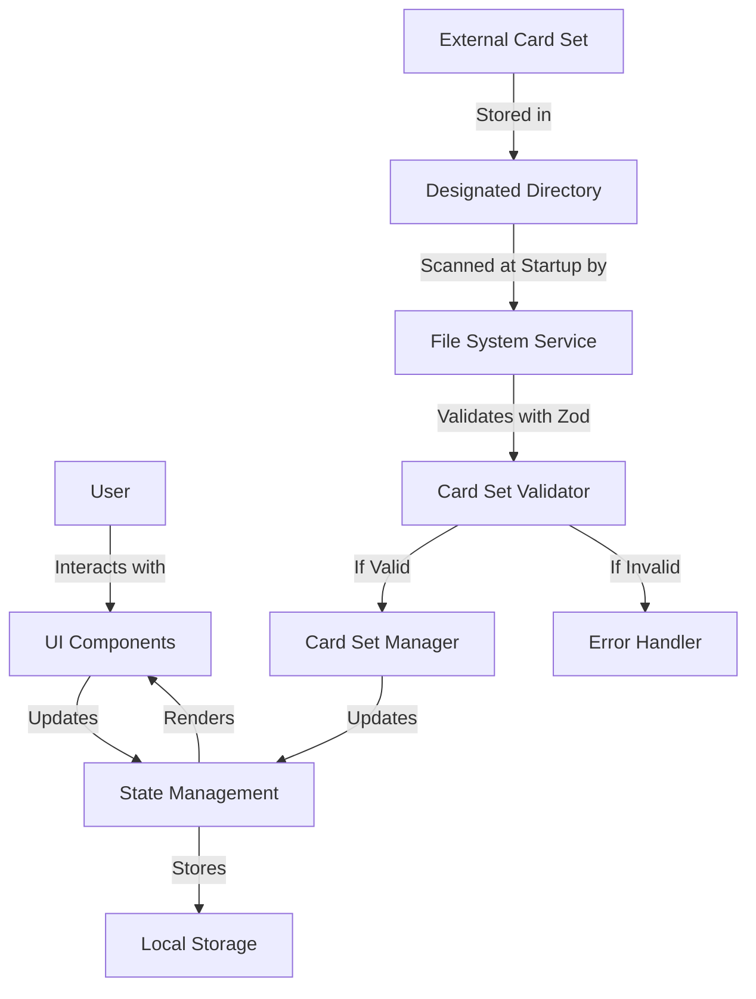
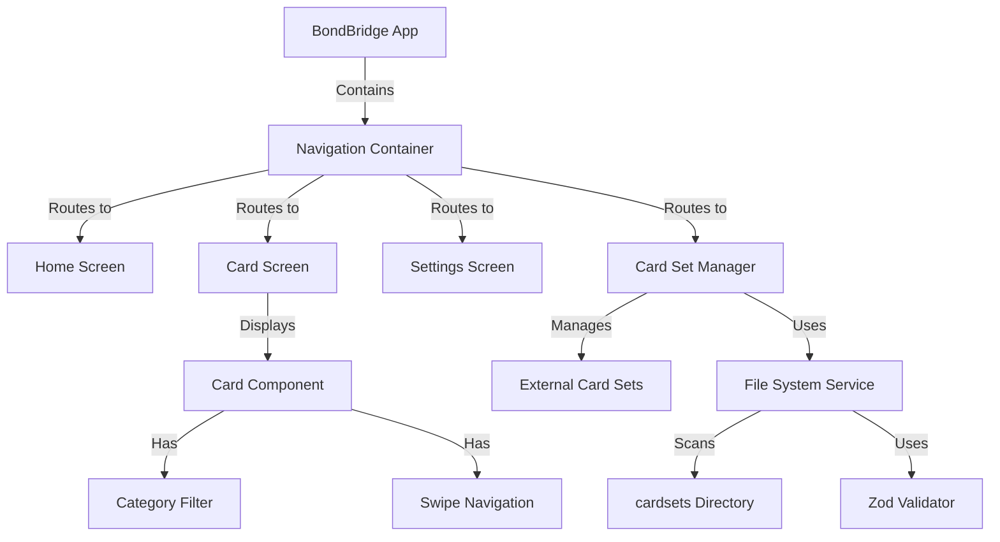
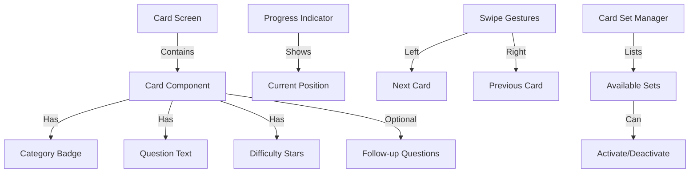

# 1. Title: PRD for BondBridge

<version>1.0.0</version>

## Status: Approved

## Related Documents

This PRD references information from the following documents:

- [Project Overview](/memory-bank/README.md)
- [Product Context](/memory-bank/productContext.md)
- [User Stories](/memory-bank/userStories.md)
- [UI Principles](/memory-bank/uiPrinciples.md)
- [Implementation Plan](/memory-bank/implementationPlan.md)

## Intro

BondBridge is a mobile application designed to help couples deepen their relationships through meaningful conversation cards, as described in [Project Brief](/memory-bank/projectBrief.md). The app offers a minimalist, user-friendly interface with swipeable conversation cards organized in thematic categories and allows for importing new card sets via JSON files. This PRD outlines the MVP (Minimum Viable Product) features and future enhancements for the BondBridge project.

## Goals

- Create an engaging, offline-capable platform for couples to facilitate meaningful conversations with a target user satisfaction rating of 4.5/5 in beta testing
- Develop a flexible content management system based on JSON card sets that processes files in under 2 seconds
- Build a scalable system architecture supporting at least 10 external card sets without performance degradation
- Deliver an intuitive user experience with minimalist design and progress tracking with an onboarding completion rate of 95%
- Prioritize offline functionality and local data storage for a seamless user experience with no data loss between sessions

## Features and Requirements

The following requirements are based on [Product Context](/memory-bank/productContext.md) and [User Stories](/memory-bank/userStories.md):

### Functional Requirements

- Display conversation cards with questions organized in 6 categories
- Allow users to navigate through cards with simple swipe functionality
- Enable basic filtering of cards by category
- Support automatic detection and integration of external card sets via JSON files stored in a designated directory
- Provide complete offline functionality with local data storage
- Implement basic progress tracking across sessions

### Non-functional Requirements

- Performance: App should load and respond quickly, with card loading times under 500ms
- Usability: Interface should be intuitive with minimal learning curve, requiring no tutorial for basic functions
- Reliability: App should function consistently without crashes, with a target crash rate below 0.1%
- Maintainability: Code should be organized, documented, and follow best practices
- Compatibility: Support iOS (14+) and Android (10+)

### User Experience Requirements

The following design specifications are based on [UI Principles](/memory-bank/uiPrinciples.md):

#### Visual Design

- **Color Palette**:

  - Background: #F5F5F5 (light gray)
  - Card Background: #FFFFFF with subtle shadow (elevation: 2dp)
  - Primary Action: #4A90E2 (blue)
  - Category-specific accent colors:
    - Icebreakers: #5BC0EB (light blue)
    - Confessions: #F44336 (red)
    - Personality: #9C27B0 (purple)
    - Deep Thoughts: #3F51B5 (indigo)
    - Intimacy: #FF9800 (orange)
    - Growth: #4CAF50 (green)

- **Typography**:

  - Font Family: Roboto or Open Sans
  - Question Text: 18pt Bold
  - Follow-up Questions: 14pt Regular
  - Category/Difficulty Text: 12pt Regular
  - All text with minimum contrast ratio of 4.5:1 for accessibility

- **Layout Guidelines**:
  - Cards centered in viewport with 16dp horizontal margins
  - Category badge positioned at top left of card
  - Difficulty indicator (1-5 stars) at bottom right
  - Question text centered vertically and horizontally in card
  - Follow-up questions indented below main question with 8dp spacing

#### Interaction Design

- **Card Swiping**:

  - Swipe left navigates to next card with 300ms slide animation
  - Swipe right navigates to previous card with 300ms slide animation
  - Cards rotate slightly (5°) during swipe for natural feel
  - Opacity changes during swipe for visual feedback
  - Haptic feedback on successful swipe (subtle vibration)

- **Progress Indicator**:

  - Dot navigation at bottom showing position (e.g., 3/20)
  - Card counter visible at bottom (e.g., "Card 3 of 20")
  - Card marked as "viewed" after 2 seconds of display or swipe
  - Visual indicator for previously viewed cards (subtle checkmark or fade)

- **Onboarding Flow**:
  - First-launch tutorial with 3 screens maximum
  - Animated demonstration of swipe gestures
  - Visual walkthrough of category filtering
  - Simple explanation of card set management
  - Skip option available for returning users

### Integration Requirements

- Automatic scanning of a designated directory (${DocumentDirectoryPath}/cardsets) for JSON card sets
- Validation of external card sets against a predefined schema using Zod
- Support for local storage to maintain user progress and settings
- File associations to open JSON files directly with the app:
  - Register as handler for .json files on both platforms
  - When a JSON file is opened with BondBridge, copy to cardsets directory
  - Validate and integrate card set with visual feedback on success/failure

### Compliance Requirements

- Privacy-focused design with no data collection in MVP
- Accessible design following WCAG 2.1 AA standards:
  - Sufficient color contrast (text on background ≥ 4.5:1)
  - Screen reader support with ARIA labels for interactive elements
  - Dynamic font size support for users needing larger text
  - Touch targets minimum size of 44x44 points
- Secure processing of external files with proper validation and error handling

### Security Requirements

- Thorough validation of all external JSON files before processing
- Graceful error handling for malformed or incompatible card sets
- Sanitization of potentially harmful content in imported card sets
- Application stability protection against corrupted files

## Epic List

The following epics are derived from [Implementation Plan](/memory-bank/implementationPlan.md):

### Epic-1: Core Application Setup (MVP)

Establish the foundational structure of the BondBridge application.

### Epic-2: Conversation Cards (MVP)

Implement the core functionality of displaying and interacting with conversation cards.

### Epic-3: External Card Set Integration (MVP)

Enable automatic detection and use of custom card sets.

### Epic-4: Offline Functionality (MVP)

Ensure the application works perfectly without internet connection.

### Epic-5: Future Enhancements (Post-MVP)

Post-MVP features to enhance the application in future versions as outlined in [Roadmap](/memory-bank/roadmap.md).

## Epic 1: Story List

- Story 1: Project Structure Setup
  Status: Complete
  Complexity: Medium
  Requirements:

  - Set up repository
  - Create feature-based folder structure
  - Configure development environment with React Native and Expo
  - Set up TypeScript configuration
  - Establish base theming

- Story 2: Navigation Framework
  Status: Complete
  Complexity: Medium
  Requirements:
  - Implement basic navigation structure
  - Create main screen containers
  - Set up navigation state management

## Epic 2: Story List

- Story 1: Card Component
  Status: InProgress
  Complexity: Large
  Requirements:

  - Create reusable card component with category indicator
  - Implement main question display
  - Apply styling based on UI principles
  - Support difficulty level display
  - Implement category-specific color accents
  - Add proper typography and layout as per design guidelines

- Story 2: Card Navigation
  Status:
  Complexity: Medium
  Requirements:

  - Implement navigation buttons (next/previous)
  - Add swipe gesture functionality with animation and rotation
  - Implement haptic feedback on successful swipe
  - Add progress indicators (dots and card counter)
  - Manage navigation state

- Story 3: Category Filtering
  Status:
  Complexity: Medium
  Requirements:

  - Create filter component for 6 categories
  - Implement interactive toggle functionality
  - Visual representation of filter status
  - Connect filter logic to card display
  - Apply category-specific styling

- Story 4: Onboarding Flow
  Status:
  Complexity: Medium
  Requirements:
  - Design onboarding screens (maximum 3)
  - Create swipe gesture demonstration animation
  - Implement category filtering walkthrough
  - Add card set management explanation
  - Provide skip option for returning users

## Epic 3: Story List

- Story 1: External Card Set Loading
  Status:
  Complexity: Large
  Requirements:

  - Create designated directory structure (${DocumentDirectoryPath}/cardsets) for card sets
  - Implement automatic directory scanning at app startup
  - Implement file system access using react-native-fs
  - Develop JSON validation system using Zod
  - Integrate external cards into the card collection
  - Provide error handling for malformed JSON files

- Story 2: Card Set Management
  Status:
  Complexity: Medium
  Requirements:
  - Create interface for viewing available card sets
  - Implement card set activation/deactivation
  - Provide feedback on successful import
  - Add in-app instructions for adding new card sets
  - Register app as handler for JSON files
  - Implement file copying and validation workflow

## Epic 4: Story List

- Story 1: Local Data Storage
  Status:
  Complexity: Medium
  Requirements:

  - Implement AsyncStorage integration
  - Design storage schema for cards, settings, and user progress
  - Create data loading and saving functions
  - Implement data persistence between sessions
  - Add error recovery for corrupted local storage

- Story 2: Progress Tracking
  Status:
  Complexity: Medium
  Requirements:
  - Implement card view tracking (2-second minimum view time)
  - Create visual indicators for viewed cards
  - Store and retrieve view history
  - Implement statistics for set completion

## Epic-5: Future Enhancements (Post-MVP)

These features are explicitly NOT part of the MVP and are planned for future development as outlined in [Roadmap](/memory-bank/roadmap.md):

- Enhanced Swipe Functionality with advanced animations and transitions
- Difficulty Level Filtering to progressively deepen conversations
- Follow-up Questions support to extend conversations
- Favorites System for marking and revisiting preferred cards
- Dark Mode Support for improved usability in low-light environments
- User Accounts and Cloud Synchronization (future consideration only)
- Social Sharing Features for sharing favorite questions
- Custom Card Creation Interface for creating personal cards

## Technology Stack

| Technology              | Description                               | Purpose                                       |
| ----------------------- | ----------------------------------------- | --------------------------------------------- |
| React Native            | Cross-platform mobile framework           | Core application development                  |
| Expo                    | Development platform for React Native     | Simplified development and deployment         |
| TypeScript              | Typed superset of JavaScript              | Type safety and improved developer experience |
| React Navigation        | Navigation library for React Native apps  | Screen navigation and routing                 |
| React Native Elements   | UI component library                      | Consistent UI components                      |
| NativeWind              | Tailwind CSS for React Native             | Streamlined styling                           |
| React Native Reanimated | Library for fluid animations              | Card swiping and transitions                  |
| AsyncStorage            | Local data persistence solution           | Offline data storage                          |
| react-native-fs         | File system access for external card sets | Accessing card set files                      |
| Zod                     | TypeScript-first schema validation        | Validating external card sets                 |

## Reference

### Data Flow Diagram



### Application Structure



### User Interface Design



## Data Models, API Specs, Schemas, etc...

### Card Schema with Validation

```typescript
import { z } from "zod";

// Zod Schema for validation
const CardCategorySchema = z.enum([
  "icebreakers",
  "confessions",
  "personality",
  "deep-thoughts",
  "intimacy",
  "growth",
]);

const DifficultyLevelSchema = z.union([
  z.literal(1),
  z.literal(2),
  z.literal(3),
  z.literal(4),
  z.literal(5),
]);

const ConversationCardSchema = z.object({
  id: z.string(),
  question: z.string(),
  followUpQuestions: z.array(z.string()).optional(),
  difficulty: DifficultyLevelSchema,
  category: CardCategorySchema,
});

const ExternalCardSetSchema = z.object({
  id: z.string(),
  name: z.string(),
  description: z.string(),
  version: z.string(),
  cards: z.array(ConversationCardSchema),
});

// TypeScript types derived from the schemas
type CardCategory = z.infer<typeof CardCategorySchema>;
type ConversationCard = z.infer<typeof ConversationCardSchema>;
type ExternalCardSet = z.infer<typeof ExternalCardSetSchema>;
```

### External Card Set JSON Format

```json
{
  "name": "Example Card Set",
  "description": "A collection of conversation starters",
  "version": "1.0.0",
  "cards": [
    {
      "id": "card-001",
      "question": "What was your most memorable vacation?",
      "followUpQuestions": [
        "What made it special?",
        "Would you like to go back?"
      ],
      "difficulty": 1,
      "category": "icebreakers"
    }
  ]
}
```

### Card Set Import Process

1. App initialization triggers scan of `${DocumentDirectoryPath}/cardsets` directory
2. JSON files are read using react-native-fs
3. Each file is validated against ExternalCardSetSchema
4. Valid card sets are added to the application state
5. Invalid files generate error logs but don't crash the application
6. Users receive feedback about imported card sets and any failures

## Project Structure

```
src/
├── features/
│   ├── conversation-cards/
│   │   ├── components/      # Card-related UI components
│   │   ├── screens/         # Card viewing screens
│   │   └── services/        # Card data management
│   ├── card-sets/
│   │   ├── components/      # Card set management UI
│   │   ├── screens/         # Import and management screens
│   │   └── services/        # JSON validation & import services
│   │       └── validators/  # Zod schema validators
│   └── settings/
│       ├── components/      # Settings UI components
│       └── screens/         # Settings screens
├── navigation/              # App navigation structure
├── shared/
│   ├── components/          # Shared UI components
│   ├── hooks/               # Custom React hooks
│   ├── services/            # Shared business logic
│   │   ├── storage/         # AsyncStorage implementation
│   │   └── filesystem/      # File system operations
│   └── utils/               # Utility functions
└── theme/                   # App styling and theming
```

## User Instructions for Adding Custom Card Sets

The application will include built-in instructions for users on how to add their own card sets:

1. Create a JSON file following the specified format (template provided in app)
2. Use a text editor to add cards with questions, categories, and difficulty levels
3. Save the file with a .json extension
4. **Method 1**: Directly open the JSON file with BondBridge (preferred method)
   - On iOS: Tap the JSON file in Files app and select "Open with BondBridge"
   - On Android: Tap the JSON file in Files app and select "Open with BondBridge"
5. **Method 2**: Transfer the file to the device's documents folder in the 'cardsets' directory:
   - For Android: `/Android/data/com.bondbridge/files/cardsets/`
   - For iOS: Use the Files app to copy to BondBridge's document directory
6. Open the app, which will automatically detect and import the new card set
7. Verify successful import in the Card Set Manager screen

## Offline Functionality Details

The application implements complete offline functionality using AsyncStorage:

1. First launch creates necessary storage structures
2. All card data is stored locally after first import
3. User progress, including:
   - Last viewed card
   - Filtered categories
   - Completed cards
   - Is persisted between sessions
4. No internet connection required after installation
5. Periodic auto-saving during app use prevents data loss
6. Storage integrity checks prevent corruption

## Change Log

| Change             | Story ID | Description                                          |
| ------------------ | -------- | ---------------------------------------------------- |
| Initial draft      | N/A      | Initial PRD creation                                 |
| UX/UI enhancements | N/A      | Added detailed design specifications and interaction |
| Cross-references   | N/A      | Added links to memory-bank documents                 |
