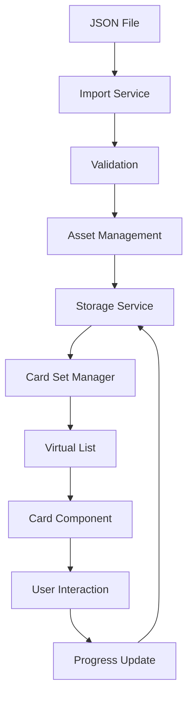
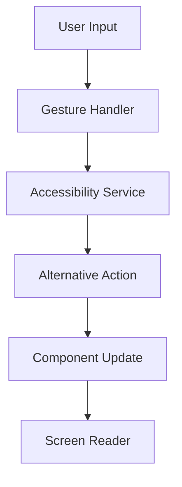
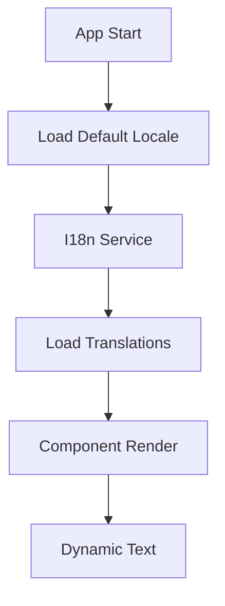
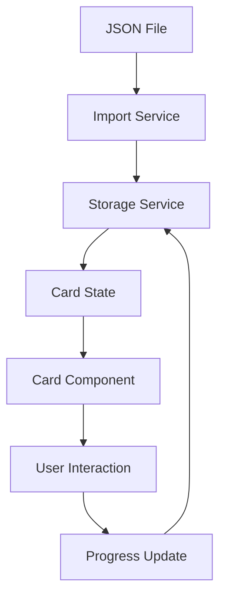

# BondBridge - Architecture Documentation

## Status: Approved

## Approval Date: 2025-03-23

## Approved By: Project Team

## Technical Summary

BondBridge is built using React Native with Expo, leveraging nativecn-ui for UI components and NativeWind for styling. The architecture follows a modular approach with clear separation of concerns.

## Technology Stack

### Core Technologies

| Technology              | Version | Purpose               |
| ----------------------- | ------- | --------------------- |
| React Native            | Latest  | Mobile app framework  |
| Expo                    | Latest  | Development platform  |
| TypeScript              | Latest  | Type-safe development |
| nativecn-ui             | Latest  | UI component library  |
| NativeWind              | Latest  | Styling solution      |
| React Native Reanimated | Latest  | Animations            |
| AsyncStorage            | Latest  | Local data storage    |

### Development Tools

| Tool     | Purpose            |
| -------- | ------------------ |
| Expo CLI | Project management |
| Jest     | Testing            |
| ESLint   | Code linting       |
| Prettier | Code formatting    |

## Project Structure

```
bondbridge/
├── src/                  # Source code
│   ├── components/       # Reusable UI components
│   ├── screens/         # App screens
│   ├── navigation/      # Navigation setup
│   ├── hooks/          # Custom React hooks
│   ├── utils/          # Utility functions
│   ├── services/       # Business logic
│   ├── types/          # TypeScript types
│   ├── theme/          # Theme configuration
│   └── i18n/           # Internationalization
├── tests/              # Test files
│   ├── components/     # Component tests
│   ├── navigation/     # Navigation tests
│   └── theme/         # Theme tests
├── assets/            # Static assets
└── config/            # Configuration files
```

### Path Aliases

The project uses TypeScript path aliases for cleaner imports:

```typescript
{
  "@/*": ["src/*"],
  "@components/*": ["src/components/*"],
  "@screens/*": ["src/screens/*"],
  "@navigation/*": ["src/navigation/*"],
  "@theme/*": ["src/theme/*"],
  "@utils/*": ["src/utils/*"],
  "@hooks/*": ["src/hooks/*"],
  "@types/*": ["src/types/*"],
  "@i18n/*": ["src/i18n/*"],
  "@assets/*": ["assets/*"]
}
```

### Testing Organization

Tests are now organized in a dedicated `tests` directory at the root level, following the same structure as the source code. This separation provides better organization and clarity:

```
tests/
├── components/          # Component test files
│   ├── Card.test.tsx
│   └── Navigation.test.tsx
├── navigation/         # Navigation test files
│   └── Navigation.test.tsx
└── theme/             # Theme test files
    └── ThemeContext.test.tsx
```

## Component Architecture

### Card Component

```typescript
// Component hierarchy
CardView
└── Card
    ├── CardContent
    │   ├── Question
    │   └── FollowUps
    └── CardProgress
```

### Navigation Structure

```typescript
// Navigation hierarchy
RootNavigator
├── MainStack
│   ├── HomeScreen
│   ├── CardViewScreen
│   └── SettingsScreen
└── ModalStack
    └── ImportScreen
```

### nativecn-ui Integration

```typescript
// Component composition pattern
import { Card as NativeCNCard } from "nativecn-ui/card";

interface CustomCardProps extends NativeCNCardProps {
  accessibility?: AccessibilityConfig;
  i18n?: I18nConfig;
}

export const Card: React.FC<CustomCardProps> = ({
  accessibility,
  i18n,
  ...props
}) => {
  const { t } = useTranslation();
  const a11y = useAccessibility(accessibility);

  return <NativeCNCard {...props} {...a11y} aria-label={t(props.ariaLabel)} />;
};
```

### Large Card Set Management

```typescript
// Virtual list implementation
import { VirtualizedList } from "react-native";

interface CardSetManagerConfig {
  maxCardsInMemory: number;
  preloadThreshold: number;
  cacheSize: number;
}

class CardSetManager {
  private config: CardSetManagerConfig;
  private cache: LRUCache<string, Card>;

  constructor(config: CardSetManagerConfig) {
    this.config = config;
    this.cache = new LRUCache({
      max: config.cacheSize,
    });
  }

  async loadCardSet(setId: string): Promise<void> {
    // Implement lazy loading
  }

  async preloadCards(indices: number[]): Promise<void> {
    // Implement card preloading
  }
}
```

### Accessibility Architecture

```typescript
// Accessibility service
interface AccessibilityConfig {
  role: AccessibilityRole;
  label: string;
  hints: string[];
  customActions?: AccessibilityAction[];
}

class AccessibilityService {
  private config: AccessibilityConfig;

  constructor(config: AccessibilityConfig) {
    this.config = config;
  }

  setupComponent(component: React.Component): void {
    // Implement accessibility setup
  }

  handleGesture(gesture: GestureType): void {
    // Implement gesture alternatives
  }
}
```

### Internationalization Structure

```typescript
// i18n configuration
interface I18nConfig {
  defaultLocale: string;
  supportedLocales: string[];
  namespaces: string[];
}

class I18nService {
  private config: I18nConfig;

  constructor(config: I18nConfig) {
    this.config = config;
  }

  async loadTranslations(locale: string): Promise<void> {
    // Implement translation loading
  }

  formatMessage(key: string, params?: object): string {
    // Implement message formatting
  }
}
```

## Data Flow

### Card Set Management Flow



### Accessibility Flow



### Internationalization Flow



### Card Data Management



## State Management

- Local component state for UI
- AsyncStorage for persistence
- Context for theme and settings

## Security Considerations

1. Input validation for JSON imports
2. Secure storage of progress data
3. Asset validation
4. Error boundary implementation

## Performance Optimization

### Memory Management

1. Virtual list implementation
2. Card set pagination
3. Image lazy loading
4. Cache management
   ```typescript
   const cacheConfig = {
     maxCardsInMemory: 50,
     preloadThreshold: 10,
     cacheSize: 100,
   };
   ```

### Asset Optimization

1. Image compression
2. Asset preloading
3. Progressive loading
4. Caching strategy
   ```typescript
   const assetConfig = {
     maxImageSize: 1024 * 1024, // 1MB
     compressionQuality: 0.8,
     cacheExpiry: 7 * 24 * 60 * 60 * 1000, // 7 days
   };
   ```

## Testing Strategy

1. Unit tests for utilities
2. Component tests
3. Integration tests
4. E2E tests with Expo

## Error Handling

1. Global error boundary
2. Import validation
3. Storage fallbacks
4. Network error handling

## Deployment Strategy

1. Expo builds
2. App store submissions
3. OTA updates
4. Version management

## Monitoring

### Performance Monitoring

1. Memory usage tracking
2. Frame rate monitoring
3. Load time metrics
4. Cache hit rates

### Accessibility Monitoring

1. Screen reader usage
2. Gesture success rates
3. Alternative action usage
4. Focus tracking

### Internationalization Monitoring

1. Language usage statistics
2. Translation coverage
3. Missing translations
4. Format errors

## Future Considerations

### Scalability

1. Cloud synchronization
2. Multi-device support
3. Real-time updates
4. Content delivery network

### Enhanced Accessibility

1. Voice commands
2. Haptic feedback
3. Custom gestures
4. Advanced screen reader support

### Internationalization Expansion

1. Right-to-left support
2. Cultural adaptations
3. Dynamic content
4. Regional variants
