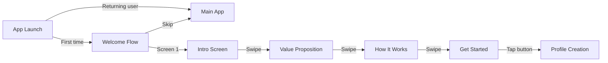

# Epic-1 - Story-1: Welcome Experience

**As a** new user
**I want** an engaging introduction to the app
**so that** I understand how to use it effectively and see its value immediately

## Status

Planned

## Context

This is the first story in Epic-1 focused on user onboarding. The welcome experience is crucial as it's the user's first interaction with the app and sets the tone for their experience. It needs to clearly communicate the app's purpose, value proposition, and get users excited about using BondBridge to enhance their relationships through conversation.

## Estimation

Story Points: 2

## Tasks

1. - [ ] Design welcome screens
   1. - [ ] Create app introduction screen with logo and tagline
   2. - [ ] Design value proposition screen highlighting key benefits
   3. - [ ] Create "how it works" screen explaining the concept
   4. - [ ] Add final "get started" screen with call to action
2. - [ ] Implement welcome flow navigation
   1. - [ ] Add swipe navigation between screens
   2. - [ ] Implement progress indicator (dots at bottom)
   3. - [ ] Add skip option for returning users
   4. - [ ] Create "Get Started" button animation
3. - [ ] Add visual elements and animations
   1. - [ ] Implement smooth transitions between screens
   2. - [ ] Add subtle animations for key elements
   3. - [ ] Ensure visual consistency with app theme
4. - [ ] Implement preference detection
   1. - [ ] Store completion status in AsyncStorage
   2. - [ ] Skip welcome flow for returning users
   3. - [ ] Add option to revisit welcome flow from settings
5. - [ ] Write content for welcome screens
   1. - [ ] Develop concise, engaging copy for each screen
   2. - [ ] Ensure text is accessible and easy to understand
   3. - [ ] Include clear calls to action

## Constraints

- Welcome flow should be completable in under 60 seconds
- Must work offline
- Must be skippable for returning users
- Text must be accessible (minimum size 16pt)
- Must support both iOS and Android platforms
- Should use the theme system for consistent styling

## Data Models / Schema

```typescript
interface OnboardingState {
  hasCompletedWelcome: boolean;
  currentScreen: number;
  totalScreens: number;
}
```

## Structure

The welcome experience will be implemented following the feature-based architecture:

```
src/
  features/
    onboarding/
      components/
        WelcomeScreen.tsx
        WelcomeProgress.tsx
        WelcomeNavigation.tsx
      screens/
        WelcomeFlow.tsx
        IntroScreen.tsx
        ValueScreen.tsx
        HowItWorksScreen.tsx
        GetStartedScreen.tsx
      hooks/
        useOnboarding.ts
      constants/
        welcomeContent.ts
```

## Diagrams

Welcome flow user journey:



## Dev Notes

- Use React Native's Animated API for smooth transitions
- Implement a consistent design language matching the app's theme
- Consider accessibility from the start - ensure text is readable and elements have proper contrast
- The welcome flow should feel lightweight and engaging rather than tedious
- Ensure the copy is friendly, conversational, and concise

## Dependencies

- Theme system must be implemented first
- AsyncStorage for saving user preferences
