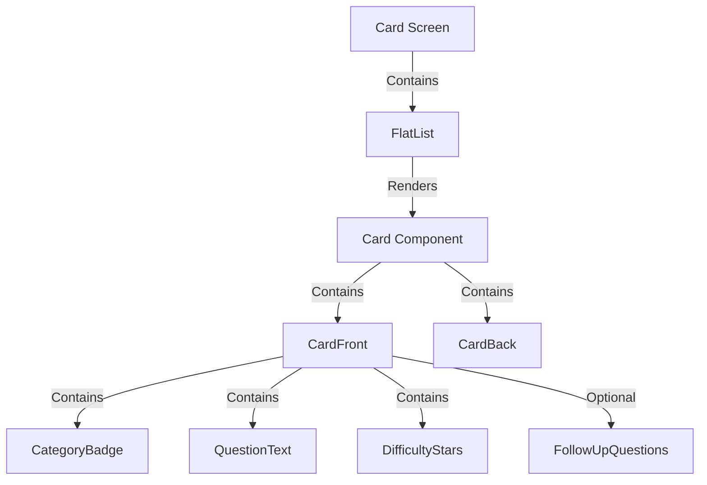

# Epic-2 - Story-1: Card Component

**As a** user
**I want** to interact with well-designed conversation cards
**so that** I can engage in meaningful conversations with my partner

## Status

InProgress

## Context

Part of Epic-2 which implements the core conversation cards functionality. This story focuses on creating the reusable card component that will display questions with appropriate styling and layout. This component is central to the user experience as it will present the conversation prompts that are the core value proposition of the app.

The architecture document specifies a feature-based approach with React Native and NativeWind for styling. The Card Component will follow the design specifications from the PRD, including proper typography, layout, and category-specific styling.

## Estimation

Story Points: 3

## Tasks

1. - [x] Setup base Card component structure
   1. - [x] Create component file in feature directory
   2. - [x] Implement basic layout with proper sizing
2. - [ ] Implement category indicator
   1. - [ ] Create CategoryBadge component
   2. - [ ] Apply category-specific accent colors
   3. - [ ] Add proper positioning at top left
3. - [ ] Implement main question display
   1. - [ ] Create QuestionText component
   2. - [ ] Apply proper typography (18pt Bold)
   3. - [ ] Center text vertically and horizontally
4. - [ ] Add difficulty level display
   1. - [ ] Create DifficultyIndicator component
   2. - [ ] Implement 1-5 stars based on difficulty level
   3. - [ ] Position at bottom right of card
5. - [ ] Support for follow-up questions
   1. - [ ] Create FollowUpQuestions component
   2. - [ ] Apply proper typography (14pt Regular)
   3. - [ ] Implement proper indentation and spacing
6. - [ ] Apply styling based on UI principles
   1. - [ ] Implement card background with subtle shadow
   2. - [ ] Ensure proper text contrast for accessibility
   3. - [ ] Add proper margins and padding
7. - [ ] Write unit tests
   1. - [ ] Test rendering with various card data
   2. - [ ] Test category-specific styling
   3. - [ ] Test difficulty level display

## Constraints

- Must follow the color palette defined in the PRD
- Must ensure accessibility with minimum contrast ratio of 4.5:1
- Must support both iOS (14+) and Android (10+)
- Cards must be centered with 16dp horizontal margins
- Must use React Native with NativeWind for styling

## Data Models / Schema

Based on the architecture document, the card data model should look like:

```typescript
interface ConversationCard {
  id: string;
  question: string;
  category: CardCategory;
  difficulty: number; // 1-5
  followUpQuestions?: string[];
}

enum CardCategory {
  Icebreakers = "icebreakers",
  Confessions = "confessions",
  Personality = "personality",
  DeepThoughts = "deepThoughts",
  Intimacy = "intimacy",
  Growth = "growth",
}
```

## Structure

The Card Component will be implemented following the feature-based architecture:

```
src/
  features/
    conversation-cards/
      components/
        Card.tsx
        CategoryBadge.tsx
        QuestionText.tsx
        FollowUpQuestions.tsx
        DifficultyIndicator.tsx
      types/
        card.types.ts
```

## Diagrams

Component hierarchy from the architecture document:



## Dev Notes

- The Card component should be memoized to prevent unnecessary re-renders
- The component should be styled according to the PRD specifications
- Each sub-component (CategoryBadge, QuestionText, etc.) should be created as a separate component for reusability
- Follow the existing project patterns for component creation and styling

## Implementation Updates

- The basic Card component implementation has been completed in `src/features/conversation-cards/components/Card.tsx`
- Theme system refactoring has been completed, allowing the Card component to properly use theme tokens
- Card styling now uses the theme hook from the new theme system: `import { useTheme } from "@theme/hooks";`

## Chat Command Log

- User: @workflow-agile-manual.mdc PLAN Next Steps
