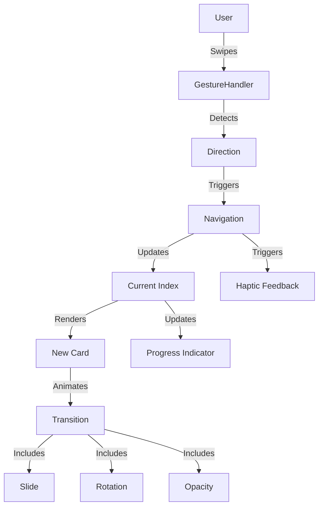

# Epic-2 - Story-2: Card Navigation

**As a** user
**I want** to easily navigate between conversation cards
**so that** I can explore different questions without interrupting the flow of conversation

## Status

Draft

## Context

Part of Epic-2 which implements the core conversation cards functionality. This story focuses on implementing navigation between cards, including swipe gestures, animations, and visual feedback. This follows Story-1 which established the Card Component itself, and now we need to make these cards navigable with a natural interaction model.

The PRD specifies specific swipe animations and transitions, and the architecture document outlines the use of React Native Reanimated for fluid animations.

## Estimation

Story Points: 2

## Tasks

1. - [ ] Implement basic navigation controls
   1. - [ ] Create next/previous button components
   2. - [ ] Implement navigation state management
   3. - [ ] Connect buttons to navigation functions
2. - [ ] Add swipe gesture functionality
   1. - [ ] Set up React Native Gesture Handler
   2. - [ ] Implement left/right swipe detection
   3. - [ ] Connect gestures to navigation functions
3. - [ ] Create card transition animations
   1. - [ ] Implement 300ms slide animation
   2. - [ ] Add 5° rotation during swipe for natural feel
   3. - [ ] Add opacity changes during swipe for visual feedback
4. - [ ] Implement haptic feedback
   1. - [ ] Add subtle vibration on successful swipe
   2. - [ ] Ensure proper timing of feedback
5. - [ ] Create progress indicator
   1. - [ ] Implement dot navigation at bottom
   2. - [ ] Add card counter (e.g., "Card 3 of 20")
   3. - [ ] Implement "viewed" state tracking
6. - [ ] Optimize performance
   1. - [ ] Implement card preloading (next 3 cards)
   2. - [ ] Add efficient rendering with FlatList
   3. - [ ] Optimize animations for smooth performance
7. - [ ] Write unit tests
   1. - [ ] Test navigation functions
   2. - [ ] Test gesture handling
   3. - [ ] Test progress tracking

## Constraints

- Card transitions must be smooth with 300ms animation duration
- Swipe gestures must feel natural with slight rotation (5°)
- Must provide haptic feedback on successful swipe
- Progress indicator must accurately reflect position in card set
- Must support both iOS (14+) and Android (10+)
- Must use theme tokens from the new theme system for consistent styling

## Data Models / Schema

The navigation state model might look like:

```typescript
interface NavigationState {
  currentIndex: number;
  totalCards: number;
  viewedCards: Set<string>; // Set of card IDs that have been viewed
  isTransitioning: boolean;
}
```

## Structure

The Card Navigation functionality will be implemented following the feature-based architecture:

```
src/
  features/
    conversation-cards/
      components/
        CardNavigation/
          NavButton.tsx
          ProgressIndicator.tsx
          DotNavigation.tsx
          CardCounter.tsx
      hooks/
        useCardNavigation.ts
      screens/
        CardScreen.tsx
```

## Diagrams

Navigation and animation flow from the architecture document:



## Dev Notes

- Use React Native Reanimated for smooth animations
- Implement gestures with React Native Gesture Handler
- Consider performance optimizations for smooth transitions
- Follow the existing project patterns for hooks and state management
- Ensure proper cleanup of animation resources when unmounting
- Use the refactored theme system for consistent styling: `import { useTheme } from "@theme/hooks";`

## Dependencies

- Story-1: Card Component must be completed first
- Theme system refactoring (completed)

## Chat Command Log

- User: @workflow-agile-manual.mdc PLAN Next Steps
