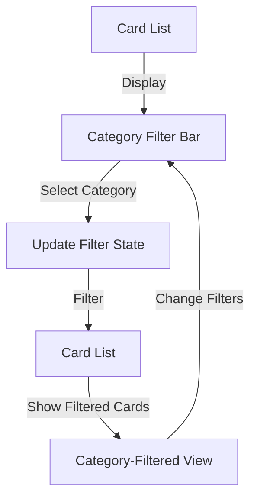

# Epic-2 - Story-3: Category Filtering

**As a** user
**I want** to filter conversation cards by category
**so that** I can focus on specific topics of interest for different situations

## Status

Planned

## Context

Part of Epic-2 focused on core conversation cards functionality. This story follows the implementation of the Card Component (Story-1) and Card Navigation (Story-2). Category filtering allows users to customize their experience by selecting specific types of conversation cards based on their current mood, situation, or relationship needs.

## Estimation

Story Points: 2

## Tasks

1. - [ ] Design category filter UI
   1. - [ ] Create horizontal category chip layout
   2. - [ ] Design active/inactive states for categories
   3. - [ ] Implement smooth animations for selection
   4. - [ ] Add visual indicators for active filters
2. - [ ] Implement filter functionality
   1. - [ ] Create filter state management
   2. - [ ] Implement category selection logic
   3. - [ ] Connect filters to card display
   4. - [ ] Add "all categories" option
3. - [ ] Add persistence for filter preferences
   1. - [ ] Store filter selections in AsyncStorage
   2. - [ ] Restore previous selections on app launch
   3. - [ ] Add reset filters functionality
4. - [ ] Create filtered card counts
   1. - [ ] Display count of cards in each category
   2. - [ ] Update counts when filters change
   3. - [ ] Handle empty states when no cards match
5. - [ ] Implement category-based navigation
   1. - [ ] Add ability to jump to specific category
   2. - [ ] Ensure navigation respects current filters
   3. - [ ] Update visual indicators for current category

## Constraints

- Must work offline
- Should provide immediate visual feedback when filters change
- Must integrate with existing card navigation system
- Should maintain state between app sessions
- Must support all defined card categories
- Should use the theme system for consistent styling
- Category selection UI must be accessible on smaller screens

## Data Models / Schema

```typescript
interface CategoryFilter {
  id: string;
  name: string;
  color: string;
  isActive: boolean;
  count: number;
}

interface FilterState {
  categories: Record<string, boolean>;
  lastUpdated: string;
}
```

## Structure

The category filter feature will be implemented following the feature-based architecture:

```
src/
  features/
    conversation-cards/
      components/
        CategoryFilter/
          CategoryChip.tsx
          CategoryFilterBar.tsx
          FilterIndicator.tsx
          FilterReset.tsx
      hooks/
        useCardFilters.ts
      contexts/
        FilterContext.tsx
      utils/
        filterStorage.ts
```

## Diagrams

Category filtering flow:



## Dev Notes

- Use React Context for sharing filter state across components
- Consider performance optimizations for filtering large card sets
- Ensure smooth animations when toggling filters
- Use semantic colors from the theme system for category indicators
- Follow accessibility guidelines for touch targets and contrast
- Make sure filtering behavior is intuitive and reversible

## Dependencies

- Story-1: Card Component
- Story-2: Card Navigation
- Theme system refactoring (completed)
- AsyncStorage for preference persistence
