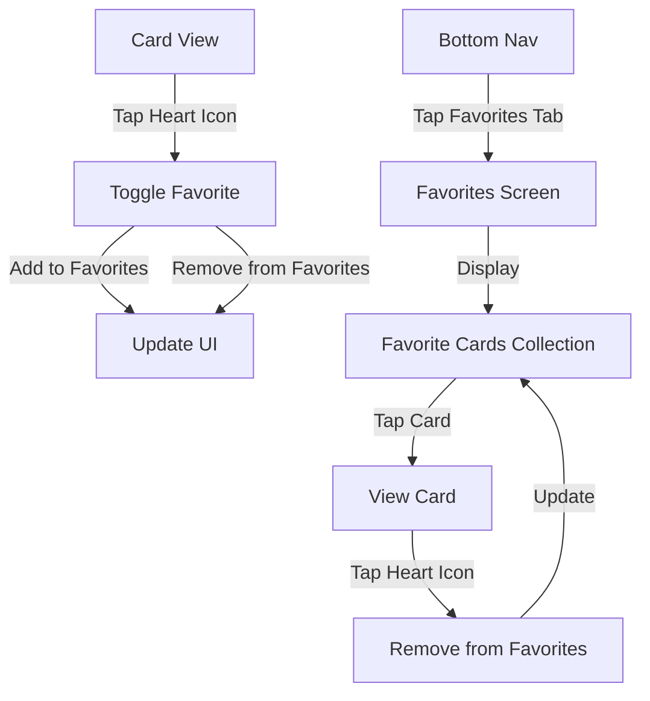

# Epic-3 - Story-2: Favorite Cards

**As a** user
**I want** to mark cards as favorites
**so that** I can easily find and revisit the conversation topics I value most

## Status

Planned

## Context

Part of Epic-3 focused on conversation progress tracking. This story enables users to mark conversation cards as favorites and provides a dedicated section to view and access these favorites. This enhances the user experience by allowing them to curate a personalized collection of their most meaningful or useful conversation prompts.

## Estimation

Story Points: 2

## Tasks

1. - [ ] Design favorite card UI elements
   1. - [ ] Create favorite icon/button for cards
   2. - [ ] Design favorite toggle animation
   3. - [ ] Implement visual indicator for favorited state
   4. - [ ] Create favorites collection view
2. - [ ] Implement favorite functionality
   1. - [ ] Add favorite toggling logic
   2. - [ ] Create favorites data storage
   3. - [ ] Implement optimistic UI updates
   4. - [ ] Add undo capability for accidental toggles
3. - [ ] Create favorites section
   1. - [ ] Design favorites tab or screen
   2. - [ ] Implement navigation to favorites
   3. - [ ] Create empty state for no favorites
   4. - [ ] Add sorting/filtering options for favorites
4. - [ ] Add persistence for favorites
   1. - [ ] Store favorites in AsyncStorage
   2. - [ ] Implement favorite sync across app views
   3. - [ ] Add error handling for storage issues
5. - [ ] Create favorite management
   1. - [ ] Implement batch operations (clear all, select multiple)
   2. - [ ] Add confirmation for deletion
   3. - [ ] Create favorite card count indicators

## Constraints

- Must work offline
- Should provide immediate visual feedback when favoriting/unfavoriting
- Favorites state must be maintained between app sessions
- Should support at least 100 favorite cards without performance issues
- Must integrate with existing card navigation system
- Should use the theme system for consistent styling

## Data Models / Schema

```typescript
interface FavoriteCard {
  cardId: string;
  addedAt: string;
  notes?: string;
}

interface FavoritesState {
  favorites: Record<string, FavoriteCard>;
  lastUpdated: string;
}
```

## Structure

The favorites feature will be implemented following the feature-based architecture:

```
src/
  features/
    conversation-cards/
      components/
        Favorites/
          FavoriteButton.tsx
          FavoriteIndicator.tsx
          FavoritesCollection.tsx
          EmptyFavorites.tsx
      screens/
        FavoritesScreen.tsx
      hooks/
        useFavorites.ts
      contexts/
        FavoritesContext.tsx
      utils/
        favoritesStorage.ts
```

## Diagrams

Favorites user flow:



## Dev Notes

- Use React Context for sharing favorites state across components
- Implement optimistic UI updates to make favoriting feel responsive
- Consider using a debounce mechanism for saving favorites to storage
- Add subtle animations for favoriting to enhance user experience
- Make sure the favorite icon is accessible and has sufficient touch area
- Follow the established theme styling for consistency

## Dependencies

- Epic-2 Core Conversation Cards functionality
- Theme system refactoring (completed)
- AsyncStorage for data persistence
