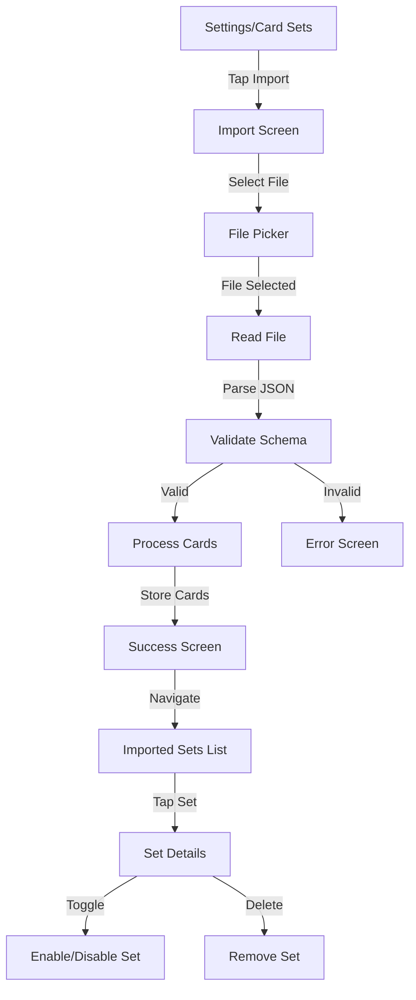

# Epic-4 - Story-1: Card Set Import

**As a** user
**I want** to import card sets from external sources
**so that** I can expand my conversation topics beyond the built-in cards

## Status

Planned

## Context

Part of Epic-4 focused on external card set integration. This story enables users to import custom card sets from JSON files, expanding their available conversation topics. This feature enhances the app's value by allowing community-created content and personalization beyond the built-in card sets.

## Estimation

Story Points: 3

## Tasks

1. - [ ] Design import UI
   1. - [ ] Create import card set button/screen
   2. - [ ] Design file picker integration
   3. - [ ] Implement progress indicators for import process
   4. - [ ] Create success/error feedback screens
2. - [ ] Implement file system access
   1. - [ ] Add file picker integration
   2. - [ ] Request appropriate permissions
   3. - [ ] Handle file selection and reading
   4. - [ ] Implement error handling for file access issues
3. - [ ] Develop card set processing
   1. - [ ] Create JSON parsing and validation
   2. - [ ] Implement card set schema validation
   3. - [ ] Add card set metadata extraction
   4. - [ ] Create duplicate detection and handling
4. - [ ] Create storage integration
   1. - [ ] Implement card set storage system
   2. - [ ] Add metadata indexing for quick access
   3. - [ ] Create card set version management
   4. - [ ] Implement storage space management
5. - [ ] Add imported set management
   1. - [ ] Create imported sets listing
   2. - [ ] Implement enable/disable functionality
   3. - [ ] Add delete capability for unwanted sets
   4. - [ ] Create set details view

## Constraints

- Must work offline
- Should support standard JSON file format
- Must validate imported files for security
- Should provide clear feedback during import process
- Must handle large files (up to 1MB) without performance issues
- Should use the theme system for consistent styling
- Must handle permissions appropriately on iOS and Android

## Data Models / Schema

```typescript
interface CardSet {
  id: string;
  name: string;
  description: string;
  author: string;
  version: string;
  lastUpdated: string;
  source: "builtin" | "imported";
  importDate?: string;
  enabled: boolean;
  cardCount: number;
  categories: string[];
  cards: Card[];
}

interface Card {
  id: string;
  question: string;
  category: string;
  difficulty: number;
  followUpQuestions?: string[];
  setId: string;
}

interface ImportResult {
  success: boolean;
  setId?: string;
  error?: string;
  cardCount?: number;
  duplicateCount?: number;
}
```

## Structure

The card set import feature will be implemented following the feature-based architecture:

```
src/
  features/
    card-sets/
      components/
        Import/
          ImportButton.tsx
          ImportProgress.tsx
          ImportResult.tsx
          SetDetails.tsx
      screens/
        ImportScreen.tsx
        ImportedSetsScreen.tsx
      hooks/
        useCardSetImport.ts
      utils/
        fileAccess.ts
        schemaValidation.ts
        importStorage.ts
```

## Diagrams

Card set import flow:



## Dev Notes

- Use react-native-file-access for file operations
- Implement comprehensive JSON schema validation
- Consider using a background task for processing large card sets
- Add proper error handling and user feedback throughout the process
- Ensure storage strategy can handle multiple imported sets
- Follow accessibility guidelines for all UI components
- Use the established theme system for visual consistency

## Dependencies

- Epic-2 Core Conversation Cards functionality
- Theme system refactoring (completed)
- AsyncStorage or SQLite for card set storage
- react-native-file-access for file operations
