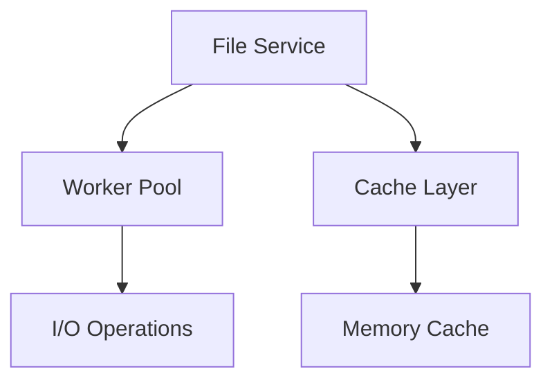

[2025-03-30 19:30:28] - Updated decisionLog.md with improvements for code readability, maintainability, performance optimization, best practices, and error handling.

# Active Context

## Version Information

- **Current Version**: 2.0.0
- **Last Updated**: 2025-03-30 19:14:46
- **Status**: Active 🟢

## Current Focus

### Core Development Priorities

1. **Centralized File Access Service**

   - Worker pool implementation
   - Performance benchmarking
   - Cache invalidation strategy

2. **Conversation Cards MVP**
   - Swipe gesture implementation
   - Card set integration
   - Basic filtering functionality

## Recent Changes

### Technical Improvements

- Implemented file access refactoring plan
- Removed debug components from production code
- Optimized swipe gesture performance

### Documentation Updates

- Updated architectural patterns in systemPatterns.md
- Reformatted decision log in decisionLog.md

## Progress Tracking

### Completed Features ✅

| Feature              | Completion Date | Details                       |
| -------------------- | --------------- | ----------------------------- |
| Theme System         | 2025-03-27      | Modular structure implemented |
| Basic Card Component | 2025-03-28      | Includes all subcomponents    |
| State Management     | 2025-03-29      | Redux slices for core data    |

[2025-03-30 19:22:55] - Refactored memory-bank to avoid double scanning of files. Updated .clinerules-code to read all memory bank files in a single operation.
[2025-03-30 19:22:55] - Refactored memory-bank to avoid double scanning of files. Updated .clinerules-code to read all memory bank files in a single operation.

### In Progress Features 🔄

| Feature             | Progress | Next Steps                          |
| ------------------- | -------- | ----------------------------------- |
| Swipe Functionality | 15%      | Implement basic gesture recognition |
| Card Navigation     | 80%      | Finalize transition animations      |

## Open Questions

### Technical Decisions

1. Optimal cache TTL duration for file service
2. Worker pool sizing strategy
3. Fallback mechanism for service failures

### Product Questions

1. Feature prioritization for MVP
2. User onboarding experience design

## Risk Assessment

| Risk                         | Likelihood | Impact | Mitigation Strategy |
| ---------------------------- | ---------- | ------ | ------------------- |
| Over-engineering features    | Medium     | High   | Strict MVP focus    |
| Performance bottlenecks      | High       | Medium | Early benchmarking  |
| Cross-platform compatibility | Medium     | High   | Continuous testing  |

## System Overview

### Current Architecture

### Key Components

1. **Theme System**

   - Modular structure
   - Type-safe implementation
   - Single source of truth

2. **State Management**
   - Redux Toolkit
   - Persistence layer
   - Optimized selectors
