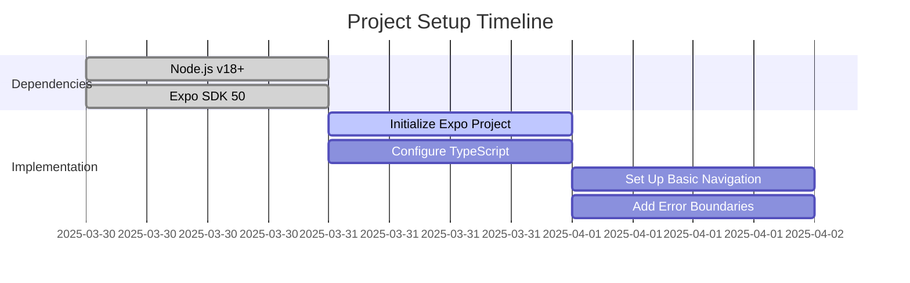

# BondBridge Implementation Plan - 2025-03-31

## 1. Core Project Setup (P0)



## 2. Enhanced Data Model Implementation (P0)

### Type Definitions & Validation

```typescript
// types/cardTypes.ts
type CardCategory = /* existing types */;

interface ConversationCard {
  /* existing fields */
  lastUsed?: Date; // New timestamp field
  isFavorite?: boolean; // Future feature flag
}

// New validation schema
const cardSchema = z.object({
  id: z.string().uuid(),
  question: z.string().min(10),
  difficulty: z.number().min(1).max(5),
  category: z.enum(['icebreakers', /* other categories */])
});
```

## 3. UI Component Development

### Enhanced Card Component (P0)

- File: `app/components/Card.tsx`
- New Requirements:
  - Accessibility attributes (aria-labels, focus management)
  - Loading states (skeleton UI)
  - Error boundary wrapper
  - Performance optimizations (memoization)

## 4. Technical Specifications

### Data Validation Specification

1. JSON Schema validation for imports
2. Runtime type checking via Zod
3. Error recovery fallbacks:
   - Skip invalid cards
   - Preserve valid portions
   - Detailed error logging

### Performance Specification

1. Virtualized lists for >50 cards
2. Memoized card components
3. Cache strategy:
   - LRU cache for recent cards
   - IndexedDB for offline storage

## 5. Updated Task Tracking

| Task                 | Owner | Status | Deadline   | Dependencies      |
| -------------------- | ----- | ------ | ---------- | ----------------- |
| Data Validation      | Dev2  | 🟠     | 2025-04-02 | TypeScript Config |
| Performance Optimize | Dev1  | 🟠     | 2025-04-03 | Card Component    |
