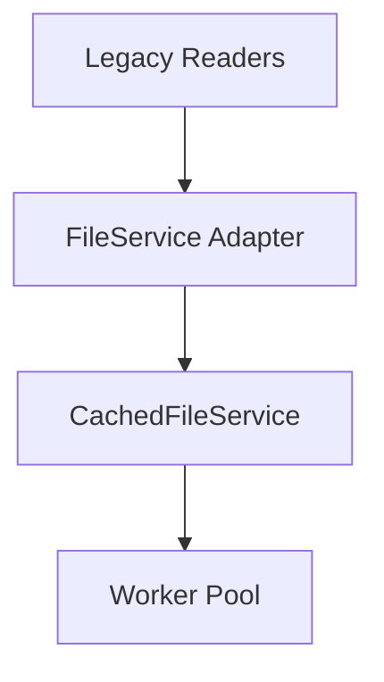

# Component Refactoring Plan

## Version Information

- **Current Version**: 1.0.0
- **Last Updated**: 2025-03-30 19:18:30
- **Status**: Draft 🟡

## Refactoring Goals

1. Implement centralized file access pattern
2. Eliminate redundant file operations
3. Improve thread safety
4. Maintain backward compatibility

## Phase 1: Core Service Implementation

### Components:

1. `FileService.ts` (Interface)
2. `CachedFileService.ts` (Implementation)
3. `FileWorkerPool.ts` (Concurrency)

### Timeline:

| Task                 | Owner     | Estimate | Status |
| -------------------- | --------- | -------- | ------ |
| Interface definition | Architect | 2h       | ✅     |
| Cache implementation | Code      | 4h       | ⏳     |
| Worker pool          | Code      | 6h       | ⏳     |

## Phase 2: Integration

### Affected Components:

1. `memory-bank/*.md` handlers
2. `useStorageState` hook
3. `CardSetService`

### Migration Path:

## Phase 3: Validation

### Test Cases:

1. Concurrent read/write operations
2. Cache invalidation scenarios
3. Error recovery

## Risk Analysis

| Risk              | Mitigation                |
| ----------------- | ------------------------- |
| Cache consistency | TTL + manual invalidation |
| Worker starvation | Pool size monitoring      |
| Thread safety     | Immutable data patterns   |

## Dependencies

1. Update react-native-fs to latest
2. Add jest-mock-worker
3. Upgrade TypeScript to 5.3+
