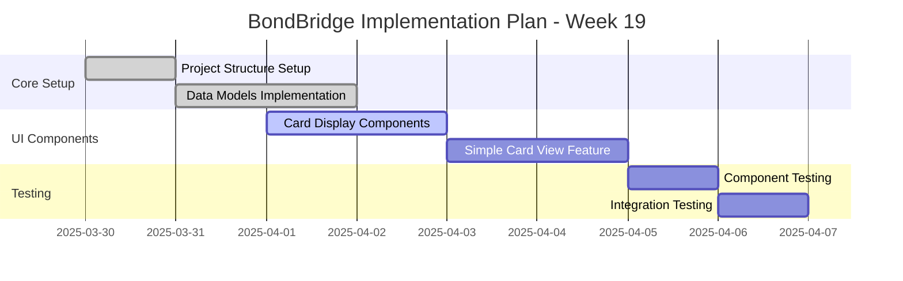

### Research Completed (2025-03-31 08:12)

- Findings documented in technical-spec-2025-03-31.md
- Key recommendations:
  - Use StyleSheet API for core styles
  - Consider NativeWind for utility-first approach
  - Implement TypeScript theme typing
- Next step: Implementation planning

## Style Centralization Research (2025-03-31)

### Research Initiated

- Task: Identify best practices for React Native style centralization
- Methods: MCP tools + web search
- Focus Areas:
  - Performance optimization
  - Maintainability patterns
  - Industry standards
  - Library/framework evaluation
- Status: In progress

# Progress - 2025-03-30

## Work Done

- Initialized memory bank core files for 2025-03-30
- Reviewed product context documentation
- Updated active context with current session details
- Documented BondBridge mobile app MVP features and roadmap
- Added architectural decisions to decision log
- Created detailed implementation plan for Week 19
- Implemented core card store functionality
- Added undo capability to card navigation
- Set up persistent storage for card progress
- Implemented Zod validation for card data

## Next Steps

### Week 19 Implementation Plan

### Priority Tasks

1. Complete UI implementation for card display components
2. Finalize Simple Card View feature
3. Set up basic testing framework
4. Implement external card set import functionality

## Current Issues

- Need to finalize animation implementation for card transitions
- Need to decide on persistence strategy for external card sets
