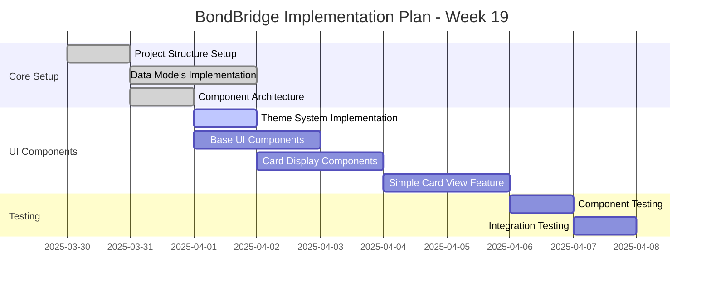

# Progress - 2025-03-31

## Work Done

### Component Architecture Planning

- Created comprehensive component architecture document (component-architecture-2025-03-31.md)
- Documented best practices for React Native component organization
- Researched and recommended critical dependencies for UI components
- Designed component structure following atomic design methodology
- Created implementation roadmap for component development
- Documented performance optimization strategies
- Defined style management architecture with NativeWind
- Outlined component design patterns (compound components, render props)
- Added architectural decisions to decision log

### Style Centralization Research

- Completed research on React Native style centralization
- Evaluated multiple styling approaches:
  - StyleSheet API
  - NativeWind
  - Restyle
  - Styled Components
  - Tamagui
- Recommended NativeWind as the best balance of developer experience and performance
- Documented theme system implementation
- Created example implementations for different styling approaches

## Next Steps

### Week 19 Implementation Plan (Updated)

### Priority Tasks

1. Implement theme system based on component architecture document
2. Create base UI components (Card, Button, Text, Container)
3. Implement card display components with NativeWind
4. Set up component testing framework
5. Finalize Simple Card View feature

## Current Issues

- Need to finalize animation implementation for card transitions
- Need to decide on persistence strategy for external card sets
- Need to determine accessibility requirements for all components
