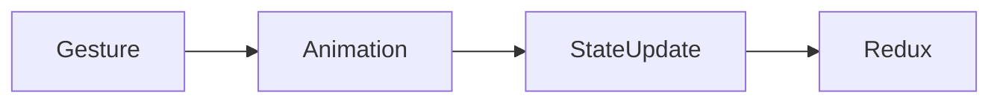
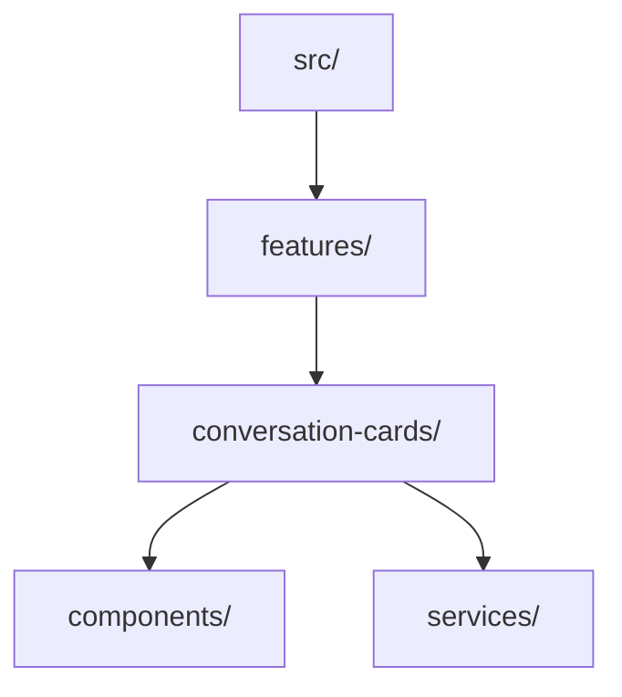

# System Patterns & Conventions

## Version Information

- **Current Version**: 2.0.0
- **Last Updated**: 2025-03-30 19:05:47
- **Status**: Active 🟢

## Core Architecture Patterns

### File Access Pattern (2025-03-30)

**Purpose**: Eliminate redundant file scans and ensure consistency

**Implementation**:

```typescript
interface MemoryBankFileService {
  readFile(path: string): Promise<string>;
  writeFile(path: string, content: string): Promise<void>;
  invalidateCache(path: string): void;
}
```

**Key Components**:

1. Singleton service instance
2. Cache-Aside strategy with TTL
3. Worker pool for I/O operations

**Benefits**:

- Single source of truth for file content
- Reduced I/O overhead
- Thread-safe operations

### Design Token System

#### Token Categories

| Category   | Examples                       |
| ---------- | ------------------------------ |
| Colors     | Primary, Secondary, Background |
| Typography | Font families, Sizes, Weights  |
| Spacing    | 8px grid system                |

### Gesture Handling Architecture

**Component Structure**:

1. `SwipeHandler` (Gesture logic)
2. `Card` (Presentation)
3. `ErrorBoundary` (Fault tolerance)

**Data Flow**:



### State Management

**Redux Implementation**:

```typescript
// Example slice configuration
const cardsSlice = createSlice({
  name: "cards",
  initialState,
  reducers: {
    addCard: (state, action) => {
      state.items.push(action.payload);
    },
  },
});
```

## Naming Conventions

| Type        | Convention | Example                |
| ----------- | ---------- | ---------------------- |
| Components  | PascalCase | `ConversationCard.tsx` |
| Functions   | camelCase  | `handleSwipe()`        |
| Directories | kebab-case | `conversation-cards/`  |

## Project Structure



## Technical Debt

| Item            | Priority | Solution                        |
| --------------- | -------- | ------------------------------- |
| react-native-fs | Medium   | Replace with expo-file-system   |
| redux-persist   | High     | Migrate to modern async storage |
| Metro version   | Low      | Resolve in next update          |

## Future Enhancements

1. **Advanced animation patterns**

   - Spring physics
   - Gesture-based transitions

2. **Zod validation integration**

   - Type-safe schemas
   - Runtime validation

3. **Performance optimizations**
   - Memoization
   - Selective re-rendering
