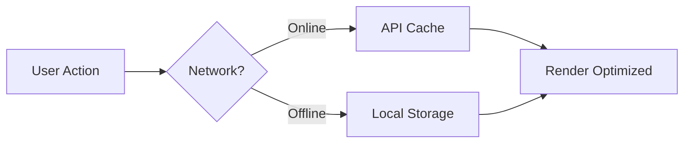

# BondBridge Technical Specification - 2025-03-31

## Data Validation

### JSON Schema

```json
{
  "$schema": "http://json-schema.org/draft-07/schema#",
  "type": "object",
  "properties": {
    "cards": {
      "type": "array",
      "items": {
        "required": ["id", "question", "difficulty", "category"],
        "properties": {
          "id": { "type": "string", "format": "uuid" },
          "question": { "type": "string", "minLength": 10 },
          "difficulty": { "type": "integer", "minimum": 1, "maximum": 5 },
          "category": {
            "enum": [
              "icebreakers",
              "confessions",
              "personality",
              "deep-thoughts",
              "intimacy",
              "growth"
            ]
          }
        }
      }
    }
  }
}
```

### Performance Architecture



## Error Handling Matrix

| Error Type          | Recovery Method | User Message             | Log Level |
| ------------------- | --------------- | ------------------------ | --------- |
| Invalid Card Format | Skip card       | "1 card skipped"         | Warning   |
| Missing Field       | Use default     | "Using default values"   | Info      |
| Corrupt File        | Full rejection  | "File could not be read" | Error     |

## Accessibility Requirements

1. WCAG AA compliance
2. Screen reader support
3. Dynamic font scaling
4. Color contrast verification
5. Keyboard navigation support
